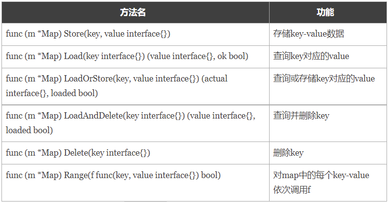

##sync.Map
Go 语言中内置的 map 不是并发安全的，请看下面这段示例代码。
```go
package main
import (
	"fmt"
	"strconv"
	"sync"
)

var m = make(map[string]int)

func get(key string) int {
	return m[key]
}

func set(key string, value int) {
	m[key] = value
}

func main() {
	wg := sync.WaitGroup{}
	for i := 0; i < 10; i++ {
		wg.Add(1)
		go func(n int) {
			key := strconv.Itoa(n)
			set(key, n)
			fmt.Printf("k=:%v,v:=%v\n", key, get(key))
			wg.Done()
		}(i)
	}
	wg.Wait()
}
```
将上面的代码编译后执行，会报出`fatal error: concurrent map writes`错误。我们不能在多个`goroutine`中并发对内置的`map`进行读写操作，否则会存在数据竞争问题。   
像这种场景下就需要为map加锁来保证并发的安全性了，Go语言的sync包中提供了一个开箱即用的并发安全版`map——sync.Map`开箱即用表示其不用像内置的 map 一样使用 make 函数初始化就能直接使用。同时`sync.Map`内置了诸如`Store、Load、LoadOrStore、Delete、Range`等操作方法。  

